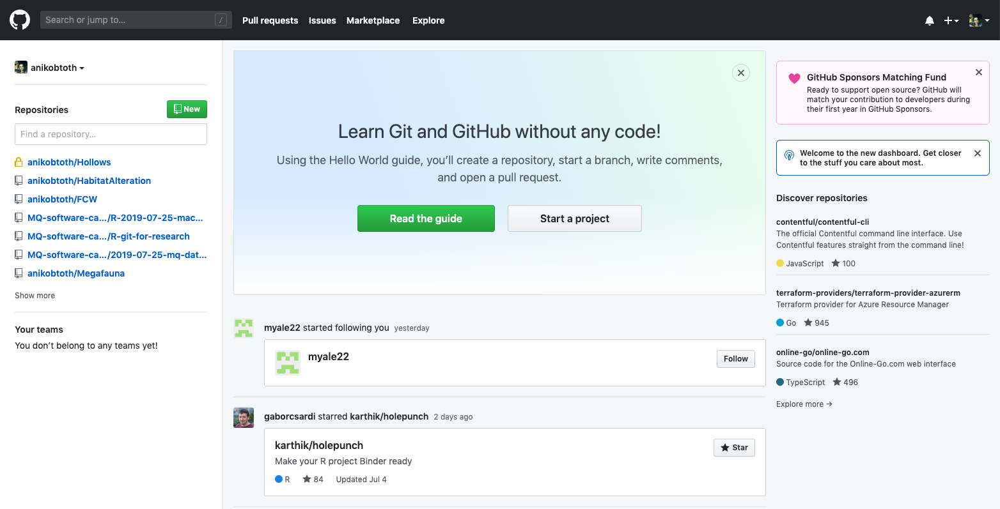
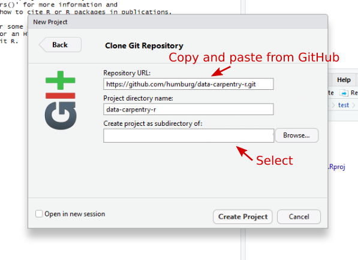

## R and RStudio

R is an open source programming language originally designed and implemented by
statisticians primarily for statistical analysis. It includes high quality
graphics capabilities and tools for data analysis and reading and writing data
to/from files.

Because R is open source and is supported by a large community of developers and
users there is a very large selection of third-party add-on packages which are
freely available to extend R's native capabilities.

R is a scripted language. Rather than pointing and clicking in a graphical
environment you write code statements to ask R to do something for you. This has
the advantage of providing a record of what was done and allows for peer review
of the work undertaken.

Having this written record, something which is increasingly required as part of
a publication submission, is also an aid when seeking help with problems.

There are many online resources such as
[stackoverflow](https://stackoverflow.com/questions/tagged/r) and the [RStudio
Community](https://community.rstudio.com/) which will allow you to seek help
from peers. Questions which are backed up with [short, reproducible code
snippets](https://www.tidyverse.org/help/) are more likely to attract knowledgeable responses.

To make it easier to interact with R, we will use RStudio. RStudio is the most popular IDE (Integrated Development Interface), to work with R. An IDE is a software that provide tools to make it easier to program. 


RStudio extends what R can do, and make it easier to write R code and interact
with R. [Credit photo left photo](https://commons.wikimedia.org/w/index.php?curid=2447462),
[Credit photo right photo](https://commons.wikimedia.org/w/index.php?curid=44599363)


## Knowing your way around RStudio

Let's start by learning about [RStudio](https://www.rstudio.com/), which is an
Integrated Development Environment (IDE) for working with R.

The RStudio IDE open-source product is free under the
[Affero General Public License (AGPL) v3](https://www.gnu.org/licenses/agpl-3.0.en.html).
The RStudio IDE is also available with a commercial license and priority email
support from RStudio, Inc.

We will use RStudio IDE to write code, navigate the files on our computer,
inspect the variables we are going to create, and visualize the plots we will
generate. RStudio can also be used for other things (e.g., developing packages, writing Shiny apps) that we will not cover during the workshop. 

One of the advantages of using RStudio is that all the information
you need to write code is available in a single window. Additionally, with many
shortcuts, autocompletion, and highlighting for the major file types you use
while developing in R, RStudio will make typing easier and less error-prone.

## A tour of RStudio


RStudio is divided into 4 "Panes": the **Source** for your scripts and documents
(top-left, in the default layout), the R **Console** (bottom-left), your
**Environment/History** (top-right), and your
**Files/Plots/Packages/Help/Viewer** (bottom-right). The placement of these
panes and their content can be customized (see menu, Tools -> Global Options ->
Pane Layout).


## Versioning your project 

### Why do we use version control?


R works together with a variety of other software tools that help make your life easier, particularly if something goes wrong. One of the most useful tools you will learn to use in this workshop is git. 

Throughout this workshop, we will be using git to keep track of our progress.
  - Git is a version control tool
  - Its main feature is a repository. A repository stores a collection of related files (such as the code and manuscript of your research project) and keeps track of all changes you make in them, kind of like track changes in Word. This provides a safety net that allows you to revert back to the last working version of your code when something breaks. 
  - A git repository is portable. It can be copied between computers, so you can work on your project from uni or from home. 
  - Git has built-in support for synchronization between copies of repositories. 
  - This also makes it very useful for collaborations, and allows others to build on your work without reinventing the wheel.
  - Versioning is becoming common practice in research, and is increasingly expected in research, paricularly if you want to publish your work. RStudio now has built-in native support for git, as do many other research tools.
  
Throughout this workshop, you will acquiring a knowledge of basic git functionality that you can apply to your own research project. Basic git functionality is not too hard to learn, but some of the more advanced functionality, which is incredibly powerful, can rapidly become more challenging. For a more in-depth introduction to using git with R, see [https://happygitwithr.com/](https://happygitwithr.com/).

A copy of your repository can (should be!) hosted in the cloud, to protect yourself from data loss due to computer crash or failure. 

GitHub is a service that offers cloud hosting for your work. There are several other hosting services available, including GitLab and BitBucket, but GitHub is the most common one. 
If you haven't already, head to [GitHub](http://github.com) now and create an account. Validate your email account (check your spam folder at [mimecast](mimecast.com) if you didn't get an email).

### Setting up your 'remote' repository in the cloud

- Login to GitHub
<figure>

<figcaption>
The homepage of GitHub when you first open your account should look something like this.
</figcaption>
</figure>

- Start a new repository (green button)... 
    - name it ("data-carpentry-r")
    - Choose public (can always change this, for now it saves us having to enter our password all the time) ...
    - Tick the checkbox to initialize with README
    - Add a .gitignore, and choose R from the list of templates. We will talk about this file later.  
    - Add a license if you wish (discuss this)

- Click on "Create Repository"

So now you have a fully operational, initialized repository in the cloud. It contains one file and one version. 

### Setting up your local environment 

RStudio provides a helpful set of tools to organise your local environment through its “Projects” interface, which remembers its location (allowing you to quickly navigate to it) and optionally preserves custom settings and open files to make it easier to resume work after a break. More to the point, projects can be under version control. Below, we will go through the steps for creating a  version controlled R Project for this tutorial. 

For this lesson we will create an RStudio project that is linked to your empty repository on GitHub. Go to the menu and click on
*File* > *New Project...* > *Version Control* > *Git*

Copy and paste the link for your personal repository on GitHub by clicking the green "Clone or Download" button, and copying the link to the clipboard.



Decide where you want to store your project (for instance, on your Desktop, or in your Documents folder), and copy the path for that location into the field that says "Create project as a subdirectory of:". Click "Create Project". If your repository is private, you may be asked to enter your GitHub username and password. 

This step "clones" the empty repository from GitHub onto your computer. Cloning is a git term that means, copy or duplicate, and ensures that the repository remembers where it came from. This makes it easier to upload, or "push", your changes to the "remote" repository later. 

One last step is required. Git requires a username and email address, so it can attribute all of your commits to you. We need to let git know what these are. 

  - Click `File` > `New File` > `R Script`
  - A new panel should open in your R studio. Save by clicking on `File` > `Save` the file and title it `Git_Setup.R`.
  - Type the following code, replacing the example name and email address with your name and email address.

``` r
system('git config --global user.email "you@example.com"')
system('git config --global user.name "Your Name"')
```
  - R Studio will run the line you cursor is on, or any code block you have highlighted. Move your cursor to the top of the file (or highlight the code block). In the upper right corner, click `Run` or use the popular keyboard shortcut, 
<kbd>Command</kbd> + <kbd>Return</kbd> (mac) or <kbd>Control</kbd> + <kbd>Return</kbd> (windows). 
  - Use <kbd>Command</kbd> + <kbd>s</kbd>  (mac) or <kbd>Control</kbd> + <kbd>s</kbd> (windows) to save your changes. 

This setup step only needs to be done once on any new device. 

Congratulations! Your new project is now ready to go.

### Using version control 

Let's make our first Commit. 
  - Navigate to the `Git` tab in the upper right hand pane of R Studio. The Git tab will display the names of any files in the project that you have changed since the last commit. 
  - Click the checkbox next to your `Git_Setup.R` script (this "stages" or "adds" the files for commit). You should also check the `data-carpentry-r.Rproj` file, which RStudio created when you made the project. This file stores project-specific settings. 
  - Click `Commit` from the top bar. 
  - A window will appear, where you will need to enter a commit message that describes the changes you just made. 
  - Click the `Commit` button. Commits can be composed of changes to several files at once. 

Go back to your GitHub repository and refresh the page. Notice that nothing has changed. Why?

To make commits in a local repository, you do not have to have a connection to a remote repository. Commits are stored locally on your computer. They need to be "Pushed" to the remote repository to appear on GitHub. Let's do that now. 

In the Git window, click "Push" in the top bar. You may be asked to enter your GitHub username and password. 

In a few seconds, your changes should appear on your GitHub repository. 


